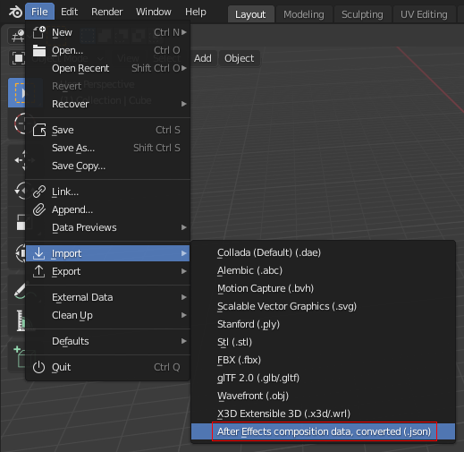

# ae-blender-camera-export

This repo includes a script for After Effects, and add-on for Blender, that allows animated camera data to be exported from the former to the latter.

## Installation / Usage (After Effects)

To install the After Effects script, first [download it](https://github.com/adroitwhiz/ae-blender-camera-export/raw/master/Export%20Camera%20Data%20to%20JSON.jsx) and then select it via File > Scripts > Install Script File...:


You'll need to restart After Effects after installing it.

To use it, you must first select the cameras you want to export:


Then, make sure you're in the Composition view:


And run the script:


## After Effects Script Options

When you run the script, a dialog box will appear:


The settings are as follows:

#### Save to
Choose the destination of the exported camera data file. This file can then be imported into Blender.

#### Time range
- "Whole comp": keyframes will be generated for the entire duration of the composition.
- "Work area": keyframes will only be generated within the composition's work area.
- "Camera layer duration": keyframes will only be generated within the duration(s) of the exported camera layer(s).

#### Comp camera is centered

If checked, the exporter will treat the center of the After Effects composition (half its width and heigh) as the 3D origin. This matches the Cineware option for using a centered comp camera, and if you select that option, you should check this box:


## Installation / Usage (Blender)

To install the Blender add-on, [download](https://github.com/adroitwhiz/ae-blender-camera-export/raw/master/import-camera-to-blender.py), install, and then enable it via the add-on preferences:


To import camera data exported from After Effects, simply navigate to File > Import > After Effects Camera data (.json):



Then navigate to the .json file exported via the After Effects script. This will create cameras in your scene that match the exported After Effects cameras.

## Development

If a script file depends on other script files, After Effects' "Install Script File" option will not work. To get around this, I've created a preprocessor script that lives in `util/preprocess.py`. To use it, simply run it via Python:

```bash
python3 util/preprocess.py
```

Or if you're on Windows:
```powershell
py -3 util\preprocess.py
```

This will generate `Export Camera Data to JSON.jsx`.

If you're working on the script, you don't need to re-preprocess the file every time you make a change--the `@include` directives are also recognized by After Effects itself. Simply run the script file located in `export-camera-from-ae` via File > Scripts > Run Script File.